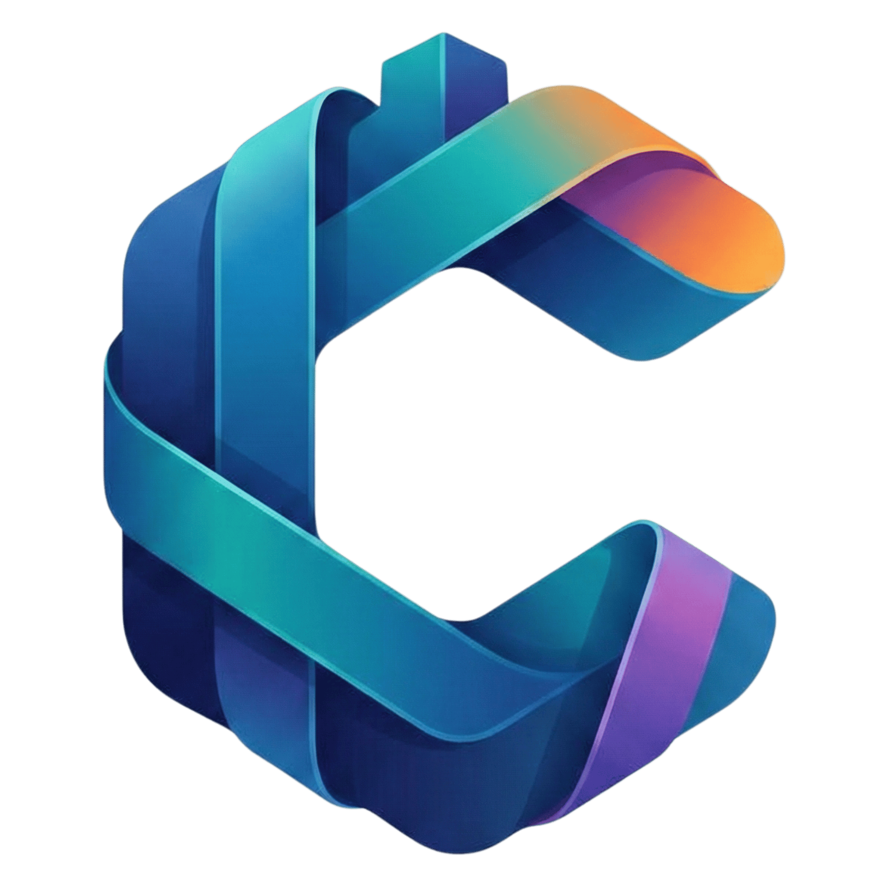

  
  <h1>Citadel</h1>
  
<b>A workspace for software engineering and document discovery.</b>

---

## Overview

Citadel is a productivity application that combines the durability of local Markdown files with structured UI elements. It is designed to help developers and power users organize interlinked digital objects without relying on deep hierarchies.

## Features

### Markdown-First
Data is stored as plain Markdown files on your local file system. Citadel uses Markdown as the source of truth, while selectively applying UI to improve navigation and surface relationships between files.

### Local AI Assistance
Citadel supports optional AI features powered by locally runnable Small Language Models (SLMs). These features are assistive and do not replace or obscure Markdown content.

### GitHub Integration
Citadel authenticates with GitHub Device Flow. You can clone or fork repositories directly into your workspace using custom `citadel://` deep links.

### Code REPLs
Execute embedded code snippets using isolated local Docker containers directly within your workspace.

### Embedded Whiteboards
Generate, store, and edit diagrams visually using integrated Excalidraw whiteboards.

### Integrated Feeds
Citadel aggregates RSS and YouTube feeds using a local SQLite database, allowing you to connect external information to your notes.

---

## Extensibility

Citadel allows customization of object types, metadata, navigation, presentation, and linking behavior. While opinionated by default, the core model can be adapted through configuration and presets.

## Contributing & Development

Citadel is an Electron-based React application built with TypeScript, Tailwind CSS, and Vite.

For instructions on compiling from source, local development, and setting up the local Text-To-Speech (TTS) server, please see the [**Contributing Guide**](CONTRIBUTING.md).

## License

MIT License
